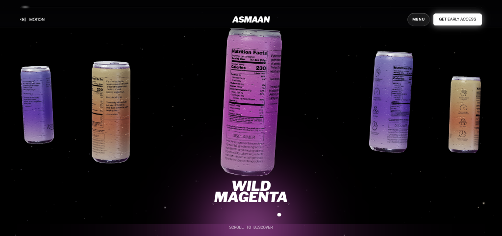
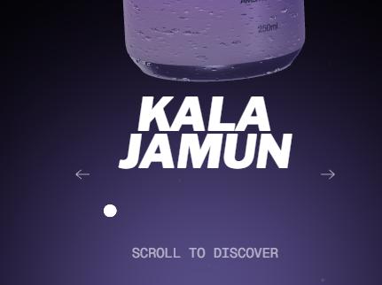

<div align="center">

# ASMAAN — Shopify Theme

**The Ambition Tonic** · Immersive 3D Shopify storefront for India's first botanical focus drink

[](https://xhp0ym-sn.myshopify.com/?pb=0)
[](https://github.com/Archit-Jain05/drinkasmaan)
[](https://shopify.dev/docs/storefronts/themes/os20)

---



*The full-viewport 3D can carousel hero, with chilled condensation droplets, ambient starfield, and per-flavour gradient lighting*

</div>

---

## What is this?

A fully custom **Shopify Online Store 2.0** theme built from scratch for **Asmaan**, India's first zero-sugar botanical focus drink. The theme is a 100% custom implementation — no starter theme, no paid template — engineered to deliver a premium, immersive experience on par with the world's most polished direct-to-consumer brands.

The design and interaction language is inspired by **Void Energy** and **Rapha**, with bespoke WebGL 3D, a cosmic starfield, liquid condensation physics, and smooth scroll-driven storytelling.

---

## ✨ Features

### 🎬 Cinematic Splash Screen
- **Letter-drop intro animation** — each letter of **A·S·M·A·A·N** drops from above into frame with staggered `cubic-bezier(0.22, 1, 0.36, 1)` spring easing
- Tagline fades up once the last letter lands
- Configurable frequency: *every load*, *once per session*, or *once ever*
- Smooth wipe-out transition revealing the main site

### 🌌 Cosmic Starfield Background
- **WebGL canvas** particle system with hundreds of depth-layered star dots
- Subtle **mouse-parallax drift** — stars shift with cursor position for a living, breathing feel
- Ambient upward drift when motion is enabled
- Respects user `prefers-reduced-motion` via the on-page Motion toggle

### 🥤 3D Multi-Can WebGL Carousel
- Real-time **Three.js** cylindrical can geometry with custom GLSL shaders
- Full 360° photorealistic label textures for all three flavours: Kala Jamun, Alphonso Mango, Wild Magenta
- **Centre-focused rotation** — only the active can auto-rotates; side cans stay perfectly still
- **Smooth drag-to-spin** on desktop and touch
- Seamless **toroidal wrap** with cubic hermite edge-fade so cans never pop in/out at the boundary
- CSS `mask-image` feathering on the canvas viewport edges for depth

### 💧 Chilled Condensation Physics
- **Per-can water droplet system** — translucent droplets with realistic gravity, surface tension wobble, and per-drop opacity variation
- Droplets only appear on the **focused (centre) can**
- Built with vanilla canvas 2D composited on top of the 3D WebGL stage
- Creates the illusion the can just came out of a fridge

### 🎨 Per-Flavour Ambient Lighting
- Each flavour has its own `--taste-primary` and `--taste-secondary` CSS custom properties
- Animated radial gradient background shifts colour on flavour change with smooth `0.6s` transitions
- Colour scheme: Jamun (deep indigo `#2A1D4A` / violet `#9089D3`), Mango (burnt sienna / warm gold), Magenta (fuchsia / rose)

### 🧭 Header & Navigation
- Fixed transparent navbar with **on-hover black slide-down background** — slides down from the very top of the screen
- **Fullscreen slide-down menu** — drops from off-screen with `transform: translateY(-100%) → translateY(0)` and `cubic-bezier(0.16, 1, 0.3, 1)` easing
- Staggered entrance for each menu link (delays from `0.08s` to `0.28s`)
- **Motion toggle** (top-left) — pauses all CSS and WebGL animation
- Logo perfectly centred at all times, even when the menu background appears
- Page scrollbar **never disappears** during menu open (no layout shift)
- *GET EARLY ACCESS* CTA pill in the top right

### 📖 Scroll-Driven Storytelling Sections
Each section uses **sticky scroll pinning** (`height: 170svh; position: sticky`) with enter/exit fade driven by a single `requestAnimationFrame` observer:

| Section | Description |
|---------|-------------|
| **Hero Range** | 3D can carousel with flavour title, pagination, and scroll prompt |
| **Tasting Notes** | Per-flavour blurb with corner bracket UI, cross-fading titles |
| **Benefits ×4** | Zero Sugar · Green Coffee Caffeine · L-theanine & Ashwagandha · Natural Colour — each a full-height sticky panel with animated icon side-nav |
| **Manifesto** | Full-bleed "NOTHING HIDDEN" typographic splash with blob field |
| **The Range** | Product card grid with Buy Now flows |
| **Wear** | Apparel / merch section |
| **FAQ** | Accordion with smooth height transitions |
| **Newsletter** | Email capture |
| **Footer** | Luxury two-column nav with wordmark, policies, and back-to-top |

### 🏪 Full Shopify OS2 Template Coverage

| Template | Route |
|----------|-------|
| `index.liquid` | `/` — Homepage |
| `product.json` | `/products/:handle` |
| `collection.json` | `/collections/:handle` |
| `cart.json` | `/cart` |
| `page.about.liquid` | `/pages/about` |
| `page.benefits.liquid` | `/pages/benefits` |
| `page.contact.liquid` | `/pages/contact` |
| `page.faq.liquid` | `/pages/faq` |
| `page.range.liquid` | `/pages/range` |
| `page.shop.liquid` | `/pages/shop` |
| `page.wear.liquid` | `/pages/wear` |
| `404.json` | Error pages |
| `password.json` | Coming soon |
| `gift_card.liquid` | Gift cards |

---

## 🗂 Repository Structure

```
drinkasmaan/
├── assets/
│   ├── asmaan-prototype.css      # Main stylesheet — design system, all section styles
│   ├── asmaan-prototype.js       # Interactive engine — 3D carousel, starfield, droplets, scroll
│   ├── three.min.js              # Three.js r158 (vendored, no CDN dependency)
│   ├── asmaan-can-*.js/css       # 3D can renderer utilities
│   ├── asmaan-label-*.jpg        # 360° wrap label textures (Jamun, Mango, Magenta)
│   ├── *-front/back/left/right.webp  # Can poster images per angle per flavour
│   └── can-asmaan.png            # Static fallback can image
│
├── sections/
│   ├── asmaan-navbar.liquid      # Fixed header with menu overlay
│   ├── asmaan-splash.liquid      # Letter-drop intro loader
│   ├── asmaan-stage.liquid       # 3D WebGL stage + all scroll sections (range, benefits, manifesto)
│   ├── asmaan-range.liquid       # Product range grid
│   ├── asmaan-wear.liquid        # Apparel / merch section
│   ├── asmaan-faq.liquid         # FAQ accordion
│   ├── asmaan-newsletter.liquid  # Email capture section
│   ├── asmaan-footer.liquid      # Footer (section schema)
│   └── main-*.liquid             # Standard OS2 page sections (product, cart, collection…)
│
├── snippets/
│   ├── asmaan-icons.liquid       # SVG icon library (arrow, bars, instagram, star, benefit icons…)
│   ├── asmaan-footer.liquid      # Footer HTML snippet (rendered in layout/theme.liquid)
│   └── asmaan-can-3d.liquid      # 3D can canvas snippet
│
├── templates/
│   ├── index.liquid              # Homepage template
│   ├── page.about/benefits/contact/faq/range/shop/wear.liquid
│   └── product/collection/cart/404/search.json
│
├── layout/
│   └── theme.liquid              # Root layout — navbar + content + footer + scripts
│
└── config/
    ├── settings_schema.json      # Theme editor global settings
    └── settings_data.json        # Saved settings values
```

---

## 🎨 Design System

### Typography
| Role | Font | Weight | Notes |
|------|------|--------|-------|
| Headings | Libre Franklin | 900 italic | All caps, tight tracking |
| Body | Geist | 300 | Clean, minimal |
| Mono / labels | Geist Mono | 400–500 | Uppercase, wide tracking |

### Colour Palette
| Token | Default | Description |
|-------|---------|-------------|
| `--taste-primary` | `#2A1D4A` | Jamun deep indigo |
| `--taste-secondary` | `#9089D3` | Jamun violet (transitions per flavour) |
| Background | `#000000` | Pure black |
| Text | `#FFFFFF` | White |
| Lines | `rgba(255,255,255,0.2)` | Subtle borders |

### Spacing Scale
Built on a fluid clamp-based scale from `--pad-t` (0.25rem) to `--pad-xxh` (10rem), all responsive without breakpoints.

---

## ⚙️ Theme Editor Settings

Every section is fully customisable through the Shopify theme editor with zero code changes:

- **Loader**: wordmark text, tagline, total duration, show frequency
- **Navbar**: announcement text, wordmark, CTA label/URL, Instagram URL
- **Stage**: per-flavour headings, blurbs, tags, poster images, label textures, SEO H1, scroll prompt
- **Benefits**: all 4 benefit titles, strikethrough labels, body copy, metric notes
- **Manifesto**: typographic lines, accessible full claim
- **Range / Wear / FAQ / Newsletter**: fully editable via Shopify blocks
- **Footer**: all nav links, policy links, brand name, tagline, copyright, Instagram URL

---

## 🚀 Deployment

This theme is deployed via a **Shopify GitHub integration** — every push to `main` automatically syncs to the live store.

```bash
# Clone the repo
git clone https://github.com/Archit-Jain05/drinkasmaan.git
cd drinkasmaan

# Make changes, then push to sync with Shopify
git add -A
git commit -m "your change"
git push origin main
```

**Live store**: [https://xhp0ym-sn.myshopify.com](https://xhp0ym-sn.myshopify.com/?pb=0)

---

## 📸 Screenshots

<div align="center">

### Hero Stage — Wild Magenta


### Flavour Title with Carousel Navigation


</div>

---

## 🔧 Technical Notes

- **No build step** — the theme uses plain CSS and vanilla JS. No Webpack, Vite, or bundler required.
- **Three.js is vendored** as `assets/three.min.js` — no external CDN dependency, works offline in Shopify preview.
- **Tailwind utility classes** are partially inlined in the HTML for layout helpers; the core design system uses custom CSS properties.
- **Scrollbar always visible** — `html { overflow-y: scroll; scrollbar-gutter: stable; }` prevents layout shift when menus or modals open.
- **60 fps budget** — all animation paths use `will-change`, `transform`, and a single shared `requestAnimationFrame` loop. Zero forced synchronous layouts.
- **Accessibility** — skip-to-content link, semantic headings, ARIA labels on all interactive controls, keyboard-navigable menu with Escape-to-close.

---

## 🍹 The Product

**Asmaan** is India's first zero-sugar, zero-jitter botanical focus drink. Each 250 ml can contains:

- **100 mg** caffeine from raw green coffee beans (not synthetic)
- **200 mg** L-theanine (Suntheanine) for smooth, jitter-free focus
- **300 mg** KSM-66 ashwagandha to dampen stress and mental fatigue
- **10 kcal** — no sugar, no crash, no artificial colour
- Himalayan mineral water base with balanced electrolytes

Available in three flavours: **Kala Jamun**, **Alphonso Mango**, **Wild Magenta**

---

<div align="center">

Made with obsession by **Archit Jain** · © 2026 Asmaan

</div>